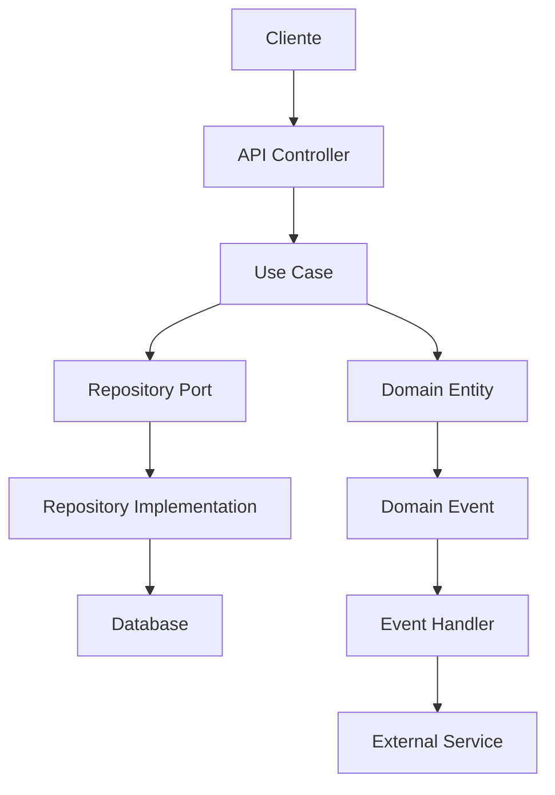

# Arquitetura do Sistema

Esta seção descreve a arquitetura do sistema de controle financeiro para casais LGBT.

## 🏛️ Visão Geral

O sistema foi projetado seguindo os princípios da **Arquitetura Hexagonal (Clean Architecture)**, garantindo:

- **Separação de responsabilidades**: Cada camada tem uma responsabilidade específica
- **Independência de frameworks**: O domínio não depende de tecnologias específicas
- **Testabilidade**: Fácil criação de testes unitários e de integração
- **Manutenibilidade**: Código organizado e fácil de evoluir

## 🏗️ Estrutura das Camadas

```
┌─────────────────────────────────────────────────────────────┐
│                    Interfaces (API/UI)                     │
├─────────────────────────────────────────────────────────────┤
│                    Application Layer                       │
│                   (Use Cases/Ports)                        │
├─────────────────────────────────────────────────────────────┤
│                    Domain Layer                            │
│              (Entities/Value Objects/Rules)                │
├─────────────────────────────────────────────────────────────┤
│                  Infrastructure Layer                      │
│              (Repositories/External Services)              │
└─────────────────────────────────────────────────────────────┘
```

### 1. Domain Layer (Domínio)
**Localização**: `packages/domain/`

Contém as regras de negócio puras do sistema:

- **Entidades**: Household, Partner, Transaction, Agreement, Goal, etc.
- **Value Objects**: Money, SplitRule
- **Regras de Negócio**: Validações e cálculos financeiros
- **Eventos de Domínio**: TransactionCreated, BudgetExceeded, etc.

**Características**:
- Não depende de outras camadas
- Contém apenas lógica de negócio
- Imutável e puro

### 2. Application Layer (Aplicação)
**Localização**: `packages/application/`

Orquestra os casos de uso e coordena as operações:

- **Use Cases**: CreateHousehold, RecordTransaction, etc.
- **Ports**: Interfaces para repositórios e serviços externos
- **DTOs**: Objetos de transferência de dados
- **Serviços de Aplicação**: SplitService, BudgetService

**Características**:
- Depende apenas do Domain
- Coordena operações de negócio
- Define contratos (ports) para infraestrutura

### 3. Infrastructure Layer (Infraestrutura)
**Localização**: `packages/infrastructure/`

Implementa as interfaces definidas na camada de aplicação:

- **Repositórios**: TypeOrmHouseholdRepository, etc.
- **Serviços Externos**: Integração bancária, notificações
- **Persistência**: Configuração do banco de dados
- **Mappers**: Conversão entre entidades de domínio e persistência

**Características**:
- Implementa os ports da Application
- Lida com detalhes técnicos
- Pode ser substituída sem afetar outras camadas

### 4. Interfaces Layer (Interfaces)
**Localização**: `packages/interfaces/`

Expõe o sistema para o mundo externo:

- **Controllers REST**: Endpoints da API
- **Workers**: Processamento assíncrono
- **Middlewares**: Autenticação, validação, etc.
- **Serializers**: Formatação de respostas

**Características**:
- Depende da Application
- Lida com protocolos de comunicação
- Converte dados entre formatos

## 🔄 Fluxo de Dados



## 📦 Organização do Monorepo

```
controle_financeiro/
├── apps/
│   ├── web/                # Frontend React
│   └── mobile/             # React Native (futuro)
├── packages/
│   ├── domain/             # Camada de Domínio
│   ├── application/        # Camada de Aplicação
│   ├── infrastructure/     # Camada de Infraestrutura
│   ├── interfaces/         # Camada de Interfaces
│   └── shared/             # Utilitários Compartilhados
├── docs/                   # Documentação
└── tests/                  # Testes E2E
```

## 🎯 Princípios de Design

### 1. Dependency Inversion
- Camadas superiores não dependem de camadas inferiores
- Abstrações não dependem de detalhes
- Detalhes dependem de abstrações

### 2. Single Responsibility
- Cada classe tem uma única responsabilidade
- Cada camada tem um propósito específico
- Separação clara de conceitos

### 3. Open/Closed Principle
- Aberto para extensão
- Fechado para modificação
- Novas funcionalidades via plugins/extensões

### 4. Interface Segregation
- Interfaces específicas e coesas
- Clientes não dependem de métodos não utilizados
- Ports bem definidos

## 🔧 Tecnologias e Ferramentas

### Backend
- **Runtime**: Node.js 18+
- **Linguagem**: TypeScript
- **Framework**: Express/Fastify
- **ORM**: TypeORM
- **Banco**: PostgreSQL

### Frontend
- **Framework**: React 18
- **Linguagem**: TypeScript
- **Styling**: Tailwind CSS
- **Build**: Next.js

### Infraestrutura
- **Monorepo**: Turborepo
- **Testes**: Jest, Testing Library
- **Linting**: ESLint, Prettier
- **CI/CD**: GitHub Actions

## 📊 Diagramas

Consulte os diagramas detalhados em:
- [Diagramas de Sistema](./system-diagrams.md)
- [Fluxos de Dados](./data-flows.md)
- [Arquitetura de Componentes](./component-architecture.md)

## 🚀 Próximos Passos

1. Implementar casos de uso básicos
2. Configurar persistência
3. Desenvolver interface de usuário
4. Implementar testes automatizados
5. Configurar CI/CD
